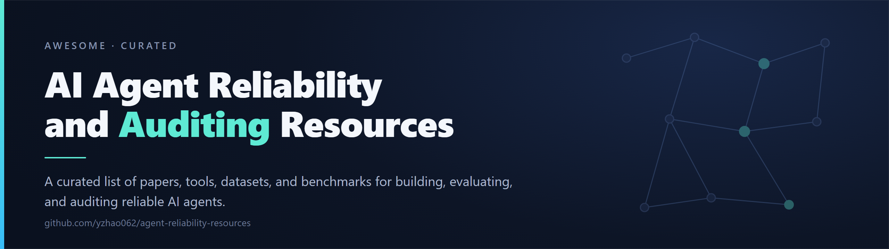
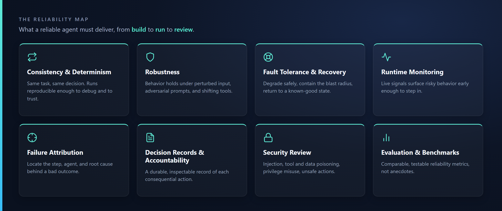

<a name="top"></a>

<div align="center">



[](https://awesome.re)
[](https://creativecommons.org/publicdomain/zero/1.0/)
[](#contributing)
[](#the-reliability-map)
[](#audit-trails-and-decision-records)

**[Reliability Map](#the-reliability-map)** &nbsp;&middot;&nbsp; **[Surveys](#surveys-and-foundations)** &nbsp;&middot;&nbsp; **[Failure Attribution](#failure-attribution-and-diagnosis)** &nbsp;&middot;&nbsp; **[Monitoring](#runtime-monitoring-and-guardrails)** &nbsp;&middot;&nbsp; **[Audit Trails](#audit-trails-and-decision-records)** &nbsp;&middot;&nbsp; **[Datasets](#datasets-and-benchmarks)** &nbsp;&middot;&nbsp; **[Tools](#tools-and-platforms)** &nbsp;&middot;&nbsp; **[Contributing](#contributing)**

</div>

> [!NOTE]
> **Reliability** is the umbrella: an agent that behaves consistently, holds up under stress, recovers from faults, and can be watched while it runs. **Auditing** is one strand within it: durable decision records, accountability for consequential actions, and post-hoc review of what an agent did and why.

A curated list of papers, tools, datasets, benchmarks, and standards for building, evaluating, and auditing reliable AI agents. Papers carry a verified link; tools carry their source repository.

<details>
<summary><b>Table of Contents</b></summary>

<br>

- [The Reliability Map](#the-reliability-map)
- [Surveys and Foundations](#surveys-and-foundations)
- [Failure Attribution and Diagnosis](#failure-attribution-and-diagnosis)
- [Reliability and Robustness](#reliability-and-robustness)
- [Runtime Monitoring and Guardrails](#runtime-monitoring-and-guardrails)
- [Audit Trails and Decision Records](#audit-trails-and-decision-records)
- [Security Auditing and Scanners](#security-auditing-and-scanners)
- [Datasets and Benchmarks](#datasets-and-benchmarks)
- [Tools and Platforms](#tools-and-platforms)
- [Standards and Governance](#standards-and-governance)
- [Related Projects](#related-projects)
- [Contributing](#contributing)

</details>

---

## The Reliability Map

A reader-first map of where AI agent reliability is won and lost. Reliability is the umbrella; auditing (decision records, accountability, post-hoc review) is one visible strand within it. The dimensions below describe outcomes a builder or reviewer should be able to demand from an agent system, not the internal machinery any one tool uses to deliver them.

<p align="center">
  
</p>

<details>
<summary><b>Reliability dimensions: detailed definitions</b></summary>

<br>

| Dimension | What a builder or reviewer should be able to demand |
|---|---|
| **Consistency and Determinism** | The same task under the same conditions produces the same decision, or the variation is bounded and explained; runs are reproducible enough to debug and to trust. |
| **Robustness** | Behavior holds under perturbed inputs, adversarial prompts, distribution shift, and unreliable tool or model responses, instead of degrading silently or unpredictably. |
| **Fault Tolerance and Recovery** | When a step, tool, or sub-agent fails, the system degrades safely, contains the blast radius, and returns to a known-good state rather than compounding the error downstream. |
| **Runtime Monitoring** | Live signals (traces, spans, tool calls, token and cost budgets, policy checks) surface risky or anomalous behavior while the agent is running, early enough to intervene. |
| **Failure Attribution and Diagnosis** | After a bad outcome, the responsible step, agent, and root cause can be located from the execution record, so the fix targets the cause rather than the symptom. |
| **Decision Records and Accountability** | Each consequential action leaves a durable, inspectable record of what was decided, on what inputs, and why, supporting later review, dispute resolution, and external audit. |
| **Security Review** | The agent is assessed for prompt injection, tool and data poisoning, privilege misuse, and unsafe action execution, with controls that hold across the tool and multi-agent surface. |
| **Evaluation and Benchmarks** | Standard tasks, datasets, and metrics measure reliability comparably across systems and over time, so claims of improvement are testable rather than anecdotal. |

</details>

<details>
<summary><b>Common failure modes:</b> spec and verification gaps, error propagation, outdated context, tool faults, unsafe actions, silent degradation</summary>

<br>

- **Specification and task-verification gaps:** the agent satisfies the literal instruction but misses the user's intent, or never verifies that its own output is correct before acting on it.
- **Error propagation across steps:** an early mistake (a wrong tool argument, a misread observation) is carried forward and amplified instead of being caught, so a small fault becomes a failed task.
- **Acting on outdated or wrong context:** the agent decides against information that no longer reflects reality, or that it misremembered, and the action is correct only for a world that has changed.
- **Inter-agent miscoordination:** in multi-agent setups, agents talk past each other, duplicate work, deadlock, or disagree on who owns a step, and no one detects the breakdown.
- **Tool and environment faults:** a tool times out, returns malformed data, or behaves differently than expected, and the agent neither retries sensibly nor surfaces the failure.
- **Unsafe or out-of-policy actions:** the agent executes a consequential side effect (a write, a payment, a deletion) that violates a constraint, sometimes induced by injected or poisoned input.
- **Nondeterministic drift:** the same prompt yields materially different trajectories across runs, making behavior hard to reproduce, test, or trust.
- **Silent degradation:** quality, latency, or cost worsens gradually with no alarm, because the system has no live signal tied to acceptable behavior.
- **Loop and runaway behavior:** the agent repeats steps, retries without progress, or consumes unbounded tokens, budget, or wall-clock time without converging.
- **Opaque failure:** something went wrong, but the execution record is too thin to say which step or agent caused it, so diagnosis stalls.


</details>

<details>
<summary><b>Evaluation axes:</b> task success and variance, robustness under stress, safety, attribution accuracy, detection quality, cost, calibration</summary>

<br>


- **Task success rate and quality** on held-out tasks, reported with confidence intervals rather than a single headline number.
- **Reproducibility and run-to-run variance:** how stable the outcome and the trajectory are across repeated runs of the same task.
- **Robustness under stress:** success retained under perturbed inputs, adversarial prompts, injected instructions, and induced tool or model faults.
- **Safety and policy adherence:** rate of constraint violations and unsafe actions, including completion measured only when policy is respected.
- **Failure attribution accuracy:** how often the responsible step or agent is correctly identified from the execution record.
- **Detection quality for monitoring:** true-positive rate at a fixed false-positive rate, plus precision, recall, and ranking metrics on flagged behavior.
- **Cost and efficiency:** tokens, tool calls, latency, and dollars per successful task, since a reliable agent that is unaffordable does not ship.
- **Calibration and uncertainty:** whether the agent's confidence and its decision to defer or ask for help track its actual accuracy.
- **Auditability:** whether an independent reviewer can reconstruct what happened and why from the recorded evidence alone.
- **Generalization:** performance on tasks, domains, and tools held out of development, not only on the data used to tune the system.


</details>

<details>
<summary><b>Open gaps:</b> no shared benchmark, weak failure-label ground truth, attribution at scale, silent-failure detection, calibrated abstention</summary>

<br>


- No shared, reliability-framed benchmark with agreed tasks and metrics; most reported numbers are not comparable across papers or tools.
- Weak ground truth for failure labels: human annotation of long traces is slow and costly, and scalable label generation is still hard to validate.
- Attribution at scale: pinpointing the decisive step in long, branching, multi-agent traces remains brittle and partly manual.
- Detecting silent, benign failures (acting on outdated or wrong context) without an attack signature, which most current security-framed tooling does not target.
- Calibrated uncertainty and reliable abstention: agents rarely know when to stop, ask, or defer, and confidence is poorly aligned with correctness.
- Reproducibility under inherent model stochasticity: making runs comparable enough to debug without discarding useful nondeterminism.
- Monitoring overhead and signal quality: live observability that catches real problems early without drowning operators in false alarms or slowing the agent.
- Standard, machine-readable decision records: no widely adopted schema yet lets reviewers and tools audit agent actions across vendors and frameworks.
- Evaluating recovery, not just detection: little agreement on how to measure whether a system actually contains a fault and returns to a safe state.
- Cost-aware reliability: jointly optimizing safety, success, and spend is mostly unaddressed, so reliability gains are often reported without their price.

</details>

---

## Surveys and Foundations

| Resource | Venue | Summary | Links |
|---|---|---|---|
| [The Rise and Potential of Large Language Model Based Agents: A Survey](https://arxiv.org/abs/2309.07864) | Sci. China Inf. Sci. 2025 | Broad survey framing LLMs as the basis for autonomous agents, covering single-agent, multi-agent, and human-agent settings. | [[Code]](https://github.com/WooooDyy/LLM-Agent-Paper-List) |
| [A Survey on Large Language Model based Autonomous Agents](https://arxiv.org/abs/2308.11432) | Front. Comput. Sci. 2024 | Systematic review of LLM-based autonomous agents with a unified construction framework and a section on agent evaluation strategies. | [[Code]](https://github.com/Paitesanshi/LLM-Agent-Survey) |
| [Large Language Model based Multi-Agents: A Survey of Progress and Challenges](https://arxiv.org/abs/2402.01680) | IJCAI 2024 | Survey of LLM multi-agent systems organized by agent profiling, communication, and capability growth, with open challenges. |  |
| [LLM Multi-Agent Systems: Challenges and Open Problems](https://arxiv.org/abs/2402.03578) | Preprint 2024 | Position-style survey of unresolved problems in multi-agent systems, including task allocation, reasoning debate, context, and memory. |  |
| [Survey on Evaluation of LLM-based Agents](https://arxiv.org/abs/2503.16416) | ACL Findings 2026 | Survey of agent evaluation across planning, tool use, web and software benchmarks, generalist agents, and evaluation frameworks, noting gaps in cost, safety, and robustness. |  |
| [AI Agents That Matter](https://arxiv.org/abs/2407.01502) | TMLR 2025 | Critique of agent benchmarking practice, arguing for cost-aware evaluation, adequate holdout sets, and reproducibility alongside accuracy. |  |
| [Visibility into AI Agents](https://arxiv.org/abs/2401.13138) | FAccT 2024 | Accountability-focused position paper proposing agent identifiers, real-time monitoring, and activity logging as measures to make agent activity answerable. |  |
| [AgentOps: Enabling Observability of LLM Agents](https://arxiv.org/abs/2411.05285) | Preprint 2024 | Taxonomy of the artifacts and trace data to record across an agent's lifecycle, drawn from a mapping study of observability tools. |  |

---

## Failure Attribution and Diagnosis

| Resource | Venue | Summary | Links |
|---|---|---|---|
| [Which Agent Causes Task Failures and When? On Automated Failure Attribution of LLM Multi-Agent Systems](https://arxiv.org/abs/2505.00212) | ICML 2025 | Defines automated failure attribution for LLM multi-agent systems and releases the Who&When dataset of annotated failure logs labeling the responsible agent and the decisive error step. | [[Code]](https://github.com/ag2ai/Agents_Failure_Attribution) |
| [Why Do Multi-Agent LLM Systems Fail?](https://arxiv.org/abs/2503.13657) | NeurIPS 2025 | Builds MAST, a 14-mode failure taxonomy in three groups (system design, inter-agent misalignment, task verification) from 1,600+ annotated traces across seven multi-agent frameworks. | [[Code]](https://github.com/multi-agent-systems-failure-taxonomy/MAST) |
| [TRAIL: Trace Reasoning and Agentic Issue Localization](https://arxiv.org/abs/2505.08638) | Preprint 2025 | Annotates 148 single- and multi-agent traces with 841 errors under a reasoning, planning, and execution taxonomy, and shows long-context models score near 11% at locating them. | [[Code]](https://github.com/patronus-ai/trail-benchmark) |
| [AgenTracer: Who Is Inducing Failure in the LLM Agentic Systems?](https://arxiv.org/abs/2509.03312) | Preprint 2025 | Curates the TracerTraj attribution dataset and trains AgenTracer-8B, a lightweight tracer that pinpoints the responsible agent and step in long failed trajectories. | [[Code]](https://github.com/bingreeky/AgenTracer) |
| [Where Did It All Go Wrong? A Hierarchical Look into Multi-Agent Error Attribution](https://arxiv.org/abs/2510.04886) | NeurIPS 2025 Workshop | Proposes ECHO, an agent- and step-level attribution method combining hierarchical context, objective analysis, and consensus voting for subtle reasoning errors. |  |
| [Aegis: Automated Error Generation and Attribution for Multi-Agent Systems](https://arxiv.org/abs/2509.14295) | ICLR 2026 | Generates controlled faults to build a 9,533-trajectory dataset with annotated faulty agents and error modes for training and evaluating attribution methods. | [[Code]](https://github.com/kfq20/AEGIS) |
| [AgentRx: Diagnosing AI Agent Failures from Execution Trajectories](https://arxiv.org/abs/2602.02475) | Preprint 2026 | Domain-agnostic diagnosis that synthesizes constraints, checks them step by step into an auditable validation log, and localizes the critical failure step into a 10-category taxonomy across three domains. | [[Code]](https://github.com/microsoft/AgentRx) |
| [Seeing the Whole Elephant: A Benchmark for Failure Attribution in LLM-based Multi-Agent Systems](https://arxiv.org/abs/2604.22708) | ACL 2026 | Introduces TraceElephant, a benchmark of 220 annotated failure traces with fully observable traces and reproducible environments, reporting large attribution gains from full observability over output-only logs. | [[Code]](https://github.com/TraceElephant/TraceElephant) |
| [Demystifying the Lifecycle of Failures in Platform-Orchestrated Agentic Workflows](https://arxiv.org/abs/2509.23735) | Preprint 2025 | Releases AgentFail, 307 real-world failures from low-code agent platforms, characterized along manifestations, root causes, and repair strategies per workflow node. |  |
| [FALAT: Tracing Failures in LLM Agent Trajectories via Dependency-Guided Search](https://arxiv.org/abs/2606.00765) | Preprint 2026 | Frames attribution as dependency-guided coarse-to-fine search that separates root-cause steps from inherited downstream errors, evaluated on the Who&When benchmark. |  |
| [TrajAudit: Automated Failure Diagnosis for Agentic Coding Systems](https://arxiv.org/pdf/2605.26563) | Preprint 2026 | Introduce TrajAudit, an approach to localize error steps in agentic coding trajectories, evaluated on a benchmark of SWE-relevant coding failure (RootSE). | [[Code]](https://github.com/LogAnalysisTech/TrajAudit) |  

---

## Reliability and Robustness

| Resource | Venue | Summary | Links |
|---|---|---|---|
| [ReliabilityBench: Evaluating LLM Agent Reliability Under Production-Like Stress Conditions](https://arxiv.org/abs/2601.06112) | Preprint 2026 | Measures tool-using agent reliability along three axes: consistency under repeated runs (pass^k), robustness to semantically equivalent task perturbations, and fault tolerance under injected tool and API failures. |  |
| [tau-bench: A Benchmark for Tool-Agent-User Interaction in Real-World Domains](https://arxiv.org/abs/2406.12045) | ICLR 2025 | Benchmarks agents in simulated tool-agent-user dialogues and introduces the pass^k metric, which scores whether an agent solves the same task on all of k independent trials. | [[Code]](https://github.com/sierra-research/tau-bench) |
| [Non-Determinism of "Deterministic" LLM System Settings in Hosted Environments](https://arxiv.org/abs/2408.04667) | Eval4NLP 2025 | Documents that repeated runs under nominally deterministic settings (temperature 0, fixed decoding) still vary in both output text and task accuracy, the source of run-to-run inconsistency in agent pipelines. |  |
| [When Agents Disagree With Themselves: Measuring Behavioral Consistency in LLM-Based Agents](https://arxiv.org/abs/2602.11619) | Preprint 2026 | Runs the same agent on the same task many times and shows ReAct-style agents take several distinct action paths per ten runs, with inconsistent tasks scoring far lower than consistent ones. |  |
| [AgentNoiseBench: Benchmarking Robustness of Tool-Using LLM Agents Under Noisy Condition](https://arxiv.org/abs/2602.11348) | Preprint 2026 | Quantifies how tool-using agents degrade under user-side instruction noise and tool-execution noise, reporting a clear accuracy drop across models under realistic perturbations. |  |
| [PALADIN: Self-Correcting Language Model Agents to Cure Tool-Failure Cases](https://arxiv.org/abs/2509.25238) | AAAI 2026 Workshop | Trains agents to detect and recover from tool malfunctions (timeouts, API exceptions, inconsistent outputs) that otherwise trigger cascading reasoning errors and task abandonment. |  |
| [Towards a Science of AI Agent Reliability](https://arxiv.org/abs/2602.16666) | ICML 2026 | Argues that a single success rate hides operational flaws and proposes twelve metrics decomposing agent reliability into consistency, robustness, predictability, and safety. |  |
| [Beyond pass@1: A Reliability Science Framework for Long-Horizon LLM Agents](https://arxiv.org/abs/2603.29231) | Preprint 2026 | Proposes reliability metrics for long-horizon tasks (reliability decay curve, variance amplification, graceful degradation, meltdown onset) and evaluates 10 models over 23,392 episodes. |  |

---

## Runtime Monitoring and Guardrails

| Resource | Venue | Summary | Links |
|---|---|---|---|
| [AI Control: Improving Safety Despite Intentional Subversion](https://arxiv.org/abs/2312.06942) | ICML 2024 | Evaluates monitoring protocols that keep a deployed model safe even when the model actively tries to subvert the oversight, using a trusted weaker model and limited trusted labor. |  |
| [Llama Guard: LLM-based Input-Output Safeguard for Human-AI Conversations](https://arxiv.org/abs/2312.06674) | Preprint 2023 | An instruction-tuned classifier that screens both user prompts and model responses against a safety risk taxonomy, the standard input-output filter that runs alongside an agent. | [[Model]](https://huggingface.co/meta-llama/Llama-Guard-3-8B) |
| [GuardAgent: Safeguard LLM Agents by a Guard Agent via Knowledge-Enabled Reasoning](https://arxiv.org/abs/2406.09187) | ICML 2025 | A guard agent that reads safety requirements, generates a check plan, and compiles it into guardrail code that verifies a target agent's actions at runtime without retraining. | [[Code]](https://github.com/guardagent/code) |
| [AgentMonitor: A Plug-and-Play Framework for Predictive and Secure Multi-Agent Systems](https://arxiv.org/abs/2408.14972) | Preprint 2024 | Captures per-agent inputs and outputs to predict task outcomes ahead of time and apply real-time corrections when a malicious agent threatens the multi-agent run. |  |
| [G-Safeguard: A Topology-Guided Security Lens and Treatment on LLM-based Multi-agent Systems](https://arxiv.org/abs/2502.11127) | ACL 2025 | Runs a graph neural network over the multi-agent utterance graph to flag compromised agents and then applies topological intervention to remediate the attack mid-run. | [[Code]](https://github.com/wslong20/G-safeguard) |
| [AGrail: A Lifelong Agent Guardrail with Effective and Adaptive Safety Detection](https://arxiv.org/abs/2502.11448) | ACL 2025 | A guardrail that generates and optimizes safety checks on the fly, adapting to task-specific and systemic risks across an agent's lifetime rather than using a fixed rule set. |  |
| [GUARDIAN: Safeguarding LLM Multi-Agent Collaborations with Temporal Graph Modeling](https://arxiv.org/abs/2505.19234) | NeurIPS 2025 | Models a multi-agent collaboration as a temporal attributed graph and uses an unsupervised encoder-decoder to detect anomalous nodes and edges as errors propagate. | [[Code]](https://github.com/JialongZhou666/GUARDIAN) |
| [SentinelAgent: Graph-based Anomaly Detection in Multi-Agent Systems](https://arxiv.org/abs/2505.24201) | Preprint 2025 | A pluggable LLM oversight agent that watches the live execution graph, scores nodes, edges, and paths against security policies, and intervenes on single-point faults or collusion. |  |
| [Pro2Guard: Proactive Runtime Enforcement of LLM Agent Safety via Probabilistic Model Checking](https://arxiv.org/abs/2508.00500) | Preprint 2025 | Estimates the likelihood of reaching an unsafe future state with a discrete-time Markov chain so the monitor can warn and intervene before a violation occurs. |  |
| [AgentSentinel: An End-to-End and Real-Time Security Defense Framework for Computer-Use Agents](https://arxiv.org/abs/2509.07764) | CCS 2025 | Intercepts sensitive operations in a computer-use agent and halts execution until a security audit clears, correlating task context with system traces in real time. |  |
| [Trajectory Guard: A Lightweight, Sequence-Aware Model for Real-Time Anomaly Detection in Agentic AI](https://arxiv.org/abs/2601.00516) | AAAI 2026 Workshop | A Siamese recurrent autoencoder that flags misaligned tasks and malformed plan structures at the step level, running an order of magnitude faster than an LLM-judge baseline. |  |

**[Tool] NeMo Guardrails** ([NVIDIA-NeMo/Guardrails](https://github.com/NVIDIA-NeMo/Guardrails)): an open-source toolkit that adds programmable rails to LLM applications and agents, intercepting requests to enforce Colang-defined policies and validate tool inputs and outputs before and after a call. [[Paper]](https://arxiv.org/abs/2310.10501) (EMNLP 2023 Demo)

**[Tool] Guardrails AI** ([guardrails-ai/guardrails](https://github.com/guardrails-ai/guardrails)): an open-source Python framework that runs input and output guards in an application, composing validators from Guardrails Hub (toxicity, PII, hallucination, and more) to detect and mitigate risks.

---

## Audit Trails and Decision Records

| Resource | Venue | Summary | Links |
|---|---|---|---|
| [Decision Provenance: Harnessing Data Flow for Accountable Systems](https://arxiv.org/abs/1804.05741) | IEEE Access 2019 | Foundational treatment of using data-flow lineage to expose decision pipelines (inputs, decisions, downstream effects) as the basis for accountability and audit. |  |
| [Audit Trails for Accountability in Large Language Models](https://arxiv.org/abs/2601.20727) | Preprint 2026 | Proposes lifecycle audit trails that record technical lineage and governance decisions (modifications, approvals, authorizations) in tamper-evident logs for LLMs in high-stakes use. |  |
| [Responsible Agentic AI Requires Explicit Provenance](https://arxiv.org/abs/2605.17169) | Preprint 2026 | Position paper arguing that responsibility becomes assignable only when agents emit traceable, attributable records across the full lifecycle; formalizes a causal attribution function and responsibility tensor. |  |
| [Auditable Agents](https://arxiv.org/abs/2604.05485) | ACL 2026 Workshop | Defines five auditability dimensions for tool-using agents (action recoverability, lifecycle coverage, policy checkability, responsibility attribution, evidence integrity) and an Auditability Card. |  |
| [Towards Security-Auditable LLM Agents: A Unified Graph Representation](https://arxiv.org/abs/2605.06812) | Preprint 2026 | Proposes Agent-BOM, a unified hierarchical attributed graph over agent execution that captures capability bindings, cognitive-state evolution, memory contamination, and cross-agent risk propagation as one structured record for post-hoc security auditing. |  |
| [The Log is the Agent: Event-Sourced Reactive Graphs for Auditable, Forkable Agentic Systems](https://arxiv.org/abs/2605.21997) | Preprint 2026 | Treats an append-only event log as the source of truth and the working graph as its projection, yielding replayable history, cheap forking, and end-to-end lineage for every run. | [[Code]](https://github.com/yoheinakajima/activegraph) |
| [TraceAegis: Securing LLM-Based Agents via Hierarchical and Behavioral Anomaly Detection](https://arxiv.org/abs/2510.11203) | Preprint 2025 | Builds lineage records from agent execution traces and abstracts them into behavioral rules; ships TraceAegis-Bench with labeled benign and abnormal traces. |  |
| [Agent-Sentry: Bounding LLM Agents via Execution Provenance](https://arxiv.org/abs/2603.22868) | Preprint 2026 | Records execution lineage from prior legitimate runs and uses it to bound and account for an agent's later actions at runtime. |  |
| [From Agent Traces to Trust: A Survey of Evidence Tracing and Execution Provenance in LLM Agents](https://arxiv.org/abs/2606.04990) | Preprint 2026 | Survey of evidence tracing and execution lineage as foundations for process-level accountability; organizes trace sources, evidence units, and lineage relations for auditable agent systems. |  |

### Decision-Record Tools

**[TypeScript] MakerChecker** ([sammysltd/MakerChecker](https://github.com/sammysltd/MakerChecker)): self-hosted governance for AI agents with role-based execution, human approval gates, and a hash-chained, Ed25519-signed audit log of every action.

**[TypeScript] aegis** ([Justin0504/aegis](https://github.com/Justin0504/aegis)): runtime policy enforcement for AI agents with a cryptographic audit trail, human-in-the-loop approvals, and a kill switch, applied with no changes to agent code.

**[TypeScript, Python] AgentLens** ([agentkitai/agentlens](https://github.com/agentkitai/agentlens)): MCP-native observability and audit-trail platform that records LLM calls, tool invocations, and decisions in an append-only, SHA-256 hash-chained, verifiable event log.

---

## Security Auditing and Scanners

| Resource | Venue | Summary | Links |
|---|---|---|---|
| [Agent Audit: A Security Analysis System for LLM Agent Applications](https://arxiv.org/abs/2603.22853) | Preprint 2026 | Static security analysis for LLM agent code and configuration, with tool-boundary taint tracking, MCP config auditing, and rules mapped to the OWASP Agentic Top 10. | [[Code]](https://github.com/HeadyZhang/agent-audit) |
| [InjecAgent: Benchmarking Indirect Prompt Injections in Tool-Integrated Large Language Model Agents](https://arxiv.org/abs/2403.02691) | ACL Findings 2024 | A benchmark of 1,054 cases that measures how often tool-integrated LLM agents follow malicious instructions embedded in tool outputs. | [[Code]](https://github.com/uiuc-kang-lab/InjecAgent) |
| [AgentDojo: A Dynamic Environment to Evaluate Prompt Injection Attacks and Defenses for LLM Agents](https://arxiv.org/abs/2406.13352) | NeurIPS D&B 2024 | An extensible environment with 97 tasks and 629 security tests for evaluating prompt-injection attacks and defenses on agents that run tools over untrusted data. | [[Code]](https://github.com/ethz-spylab/agentdojo) |
| [SoK: The Attack Surface of Agentic AI: Tools, and Autonomy](https://arxiv.org/abs/2603.22928) | Preprint 2026 | A systematization of security risks and attack vectors in agentic systems that combine language models with tools, retrieval, and autonomous decision loops. |  |
| [Model Context Protocol Threat Modeling and Analyzing Vulnerabilities to Prompt Injection with Tool Poisoning](https://arxiv.org/abs/2603.22489) | Preprint 2026 | A threat model for Model Context Protocol clients showing how unvalidated tool metadata enables prompt injection and tool poisoning, with static-analysis and behavioral defenses. |  |
| [Systematization of Knowledge: Security and Safety in the Model Context Protocol Ecosystem](https://arxiv.org/abs/2512.08290) | Preprint 2025 | A survey of security and safety issues across the Model Context Protocol ecosystem, including tool poisoning, supply-chain risk, and proposed mitigations. |  |

### Scanners

**[Python] agent-audit** ([HeadyZhang/agent-audit](https://github.com/HeadyZhang/agent-audit)): static security scanner for LLM agents that flags prompt-injection sinks, audits MCP configuration, and runs tool-boundary taint analysis, with rules mapped to the OWASP Agentic Top 10 (2026); supports LangChain, CrewAI, and AutoGen.

**[Python] garak** ([NVIDIA/garak](https://github.com/NVIDIA/garak)): an LLM vulnerability scanner that probes models and agents for prompt injection, jailbreaks, data leakage, and toxic generation, with detectors that score each probe.

**[Python] Agentic Radar** ([splx-ai/agentic-radar](https://github.com/splx-ai/agentic-radar)): an open-source scanner that maps agentic workflows through static analysis, detects MCP servers and tools, and produces a security report with OWASP-aligned vulnerability mapping; supports LangGraph, CrewAI, OpenAI Agents, AutoGen, and n8n.

**[Standard] OWASP Top 10 for Agentic Applications (2026)** ([OWASP GenAI Security Project](https://genai.owasp.org/resource/owasp-top-10-for-agentic-applications-for-2026/)): community-maintained catalog of the top security risks for autonomous AI agents, including goal hijack, tool misuse, identity abuse, and supply-chain compromise, with mitigations.

---

## Datasets and Benchmarks

| Resource | Venue | Summary | Links |
|---|---|---|---|
| [TrajAudit: Automated Failure Diagnosis for Agentic Coding Systems](https://arxiv.org/pdf/2605.26563) | Preprint 2026 | RootSE: A benchmark of 102 failure trajectories from agentic coding systems with human-annotated error steps. These failures span coding phases, including localization, patch generation, verification, and environmental failures. | [[Code]](https://github.com/LogAnalysisTech/TrajAudit) |  
| [TRAIL: Trace Reasoning and Agentic Issue Localization](https://arxiv.org/abs/2505.08638) | Preprint 2025 | A corpus of 148 human-annotated agent execution traces with 841 labeled errors across reasoning, execution, and planning categories, built from GAIA and SWE-bench tasks for locating where an agent run went wrong. | [[Code]](https://github.com/patronus-ai/trail-benchmark) |
| [Which Agent Causes Task Failures and When? (Who&When)](https://arxiv.org/abs/2505.00212) | ICML 2025 | Introduces the Who&When dataset of failure logs from 127 multi-agent systems, each annotated with the responsible agent and the decisive error step, for studying automated failure attribution. | [[Code]](https://github.com/ag2ai/Agents_Failure_Attribution) |
| [Aegis: Automated Error Generation and Attribution for Multi-Agent Systems](https://arxiv.org/abs/2509.14295) | ICLR 2026 | A dataset of 9,533 trajectories with annotated faulty agents and error modes, generated by injecting context-aware errors into successful runs across several multi-agent architectures. | [[Data]](https://huggingface.co/datasets/Fancylalala/AEGIS) |
| [tau-bench: A Benchmark for Tool-Agent-User Interaction in Real-World Domains](https://arxiv.org/abs/2406.12045) | ICLR 2025 | A retail and airline benchmark that scores agents by comparing final database state to a goal state and reports pass^k to measure how consistently an agent succeeds over repeated trials. | [[Code]](https://github.com/sierra-research/tau-bench) |
| [ReliabilityBench: Evaluating LLM Agent Reliability Under Production-Like Stress Conditions](https://arxiv.org/abs/2601.06112) | Preprint 2026 | A benchmark that measures agent reliability along three axes: consistency under repeated execution (pass^k), tolerance to semantically equivalent task perturbations, and fault tolerance under injected tool and API failures. |  |
| [GAMMAF: A Common Framework for Graph-Based Anomaly Monitoring Benchmarking in LLM Multi-Agent Systems](https://arxiv.org/abs/2604.24477) | Preprint 2026 | An evaluation framework that generates synthetic multi-agent interaction datasets and standardizes the comparison of graph-based anomaly detectors over agent communication graphs. |  |
| [SWE-bench: Can Language Models Resolve Real-World GitHub Issues?](https://arxiv.org/abs/2310.06770) | ICLR 2024 | 2,294 software-engineering tasks drawn from real GitHub issues and their fix pull requests across 12 Python repositories, with unit-test verification of each generated patch. | [[Code]](https://github.com/SWE-bench/SWE-bench) |
| [SWE-agent: Agent-Computer Interfaces Enable Automated Software Engineering](https://arxiv.org/abs/2405.15793) | NeurIPS 2024 | An open-source coding-agent framework whose released run trajectories on SWE-bench provide reusable step-by-step records of tool calls and edits for trace-level study. | [[Code]](https://github.com/SWE-agent/SWE-agent) |
| [AgentBench: Evaluating LLMs as Agents](https://arxiv.org/abs/2308.03688) | ICLR 2024 | A suite of eight interactive environments for measuring multi-turn decision-making of LLM agents, with logged interaction records across many models. | [[Code]](https://github.com/THUDM/AgentBench) |
| [GAIA: a benchmark for General AI Assistants](https://arxiv.org/abs/2311.12983) | ICLR 2024 | 466 real-world questions that require multi-step reasoning, web browsing, and tool use, with a single correct answer per item for unambiguous scoring of assistant behavior. | [[Data]](https://huggingface.co/datasets/gaia-benchmark/GAIA) |
| [WebArena: A Realistic Web Environment for Building Autonomous Agents](https://arxiv.org/abs/2307.13854) | ICLR 2024 | A reproducible environment of self-hosted websites with long-horizon tasks scored by functional correctness of the end state, useful for repeatable agent evaluation. | [[Code]](https://github.com/web-arena-x/webarena) |

Several entries below cross-reference a paper listed in a topical section above; they are repeated here so the reader can find the datasets in one place.

---

## Tools and Platforms

Open-source tools and platforms for agent observability, evaluation, and reliability. License and activity note follow each entry.

**[Python, TypeScript] Langfuse** ([langfuse/langfuse](https://github.com/langfuse/langfuse)): self-hostable platform for tracing LLM and agent calls, running evaluations, managing prompts, and tracking cost and latency, with OpenTelemetry, LangChain, and OpenAI SDK integrations. MIT-licensed core, 2023-present.

**[Python] Arize Phoenix** ([Arize-ai/phoenix](https://github.com/Arize-ai/phoenix)): open-source observability and evaluation tool built on OpenTelemetry for tracing, evaluating, and debugging LLM and agent applications, with auto-instrumentation for common frameworks. Elastic License 2.0, 2023-present.

**[Python] OpenInference** ([Arize-ai/openinference](https://github.com/Arize-ai/openinference)): a set of OpenTelemetry-compatible conventions and instrumentation packages for capturing traces from LLM and agent frameworks; works with any OpenTelemetry backend. Apache-2.0, 2023-present.

**[Python] Opik** ([comet-ml/opik](https://github.com/comet-ml/opik)): open-source platform for tracing, evaluating, and monitoring LLM applications and agentic workflows, with LLM-as-a-judge scoring, experiment tracking, and production dashboards. Apache-2.0, 2024-present.

**[Python] OpenLLMetry** ([traceloop/openllmetry](https://github.com/traceloop/openllmetry)): OpenTelemetry-based instrumentation for LLM applications that emits standard OpenTelemetry traces routable to existing observability backends; SDKs across Python, TypeScript, Go, and Ruby. Apache-2.0, 2023-present.

**[Python] Helicone** ([Helicone/helicone](https://github.com/Helicone/helicone)): open-source observability platform and AI gateway that logs LLM and agent traces, costs, and latency through a proxy and a unified API across providers. Apache-2.0, 2023-present.

**[Python] DeepEval** ([confident-ai/deepeval](https://github.com/confident-ai/deepeval)): open-source evaluation framework that runs LLM and agent tests in a pytest-style workflow, with metrics for hallucination, relevancy, and task correctness suitable for CI checks. Apache-2.0, 2023-present.

**[Python] Evidently** ([evidentlyai/evidently](https://github.com/evidentlyai/evidently)): open-source framework to evaluate, test, and monitor ML and LLM systems, covering tabular data quality, drift checks, and 100+ text and LLM evaluation metrics. Apache-2.0, 2020-present.

**[Python] AgentOps** ([AgentOps-AI/agentops](https://github.com/AgentOps-AI/agentops)): open-source SDK for monitoring AI agents, with session replays, cost tracking, and failure detection; integrates with CrewAI, OpenAI Agents SDK, LangChain, and AG2 (formerly AutoGen). MIT-licensed, 2024-present.

**[Managed] LangSmith** ([langchain.com/langsmith-platform](https://www.langchain.com/langsmith-platform)): framework-agnostic platform from the LangChain team for tracing, offline and online evaluation, and monitoring of LLM and agent applications. Commercial managed service, not self-hosted open source, 2023-present.

**[Paper] RAGAs: Automated Evaluation of Retrieval Augmented Generation** (Es et al., EACL 2024 Demo): reference-free evaluation framework for retrieval-augmented generation pipelines, scoring faithfulness, answer relevance, and context quality; the basis of the open-source Ragas library. [[PDF]](https://aclanthology.org/2024.eacl-demo.16/), [[Code]](https://github.com/explodinggradients/ragas)

---

## Standards and Governance

Standards and governance instruments for agent reliability and accountability. Papers appear first, then the standards and frameworks.

| Resource | Venue | Summary | Links |
|---|---|---|---|
| [Model Cards for Model Reporting](https://arxiv.org/abs/1810.03993) | FAT* 2019 | Proposes short standardized documents that report a model's intended use, evaluation conditions, and performance across groups, a foundational accountability artifact for deployed models. |  |
| [Datasheets for Datasets](https://arxiv.org/abs/1803.09010) | CACM 2021 | Proposes a standard datasheet documenting a dataset's motivation, composition, collection process, and recommended uses to improve transparency and accountability. |  |
| [Closing the AI Accountability Gap: Defining an End-to-End Framework for Internal Algorithmic Auditing](https://arxiv.org/abs/2001.00973) | FAT* 2020 | Defines SMACTR, an internal audit framework that produces a documented decision trail across the development lifecycle so teams can assess systems before deployment. |  |
| [Black-Box Access is Insufficient for Rigorous AI Audits](https://arxiv.org/abs/2401.14446) | FAccT 2024 | Argues that meaningful third-party AI audits need more than query access, comparing black-box, white-box, and outside-the-box methods and their accountability implications. |  |
| [Authenticated Delegation and Authorized AI Agents](https://arxiv.org/abs/2501.09674) | ICML 2025 (Position) | Extends OAuth 2.0 and OpenID Connect with agent-specific credentials so permissions delegated to autonomous agents stay scoped, auditable, and traceable to a responsible human. |  |
| [AI Identity: Standards, Gaps, and Research Directions for AI Agents](https://arxiv.org/abs/2604.23280) | Preprint 2026 | Surveys current identity, delegation, and accountability standards for agents acting across organizational boundaries and maps the open gaps that current frameworks leave unaddressed. |  |

### Standards and Frameworks

**[Standard] OpenTelemetry Semantic Conventions for Generative AI (gen-ai)** ([opentelemetry.io](https://opentelemetry.io/docs/specs/semconv/gen-ai/), [spec repo](https://github.com/open-telemetry/semantic-conventions)): vendor-neutral telemetry schema for GenAI and agent spans, metrics, and events, covering model calls, tool calls, token usage, and agent and framework operations so traces are comparable across stacks. OpenTelemetry / CNCF, 2024-2026 (living spec).

**[Standard] NIST AI 600-1, Generative AI Profile** ([nvlpubs.nist.gov](https://nvlpubs.nist.gov/nistpubs/ai/NIST.AI.600-1.pdf)): cross-sector companion to the NIST AI RMF that names twelve GenAI risk areas and over 200 suggested actions across the Govern, Map, Measure, and Manage functions. NIST, July 2024.

**[Standard] NIST AI 100-1, AI Risk Management Framework (AI RMF 1.0)** ([nvlpubs.nist.gov](https://nvlpubs.nist.gov/nistpubs/ai/nist.ai.100-1.pdf)): the base voluntary framework that organizes AI trustworthiness and risk work into the Govern, Map, Measure, and Manage functions; the parent document the GenAI profile extends. NIST, January 2023.

**[Standard] EU AI Act (Regulation 2024/1689), Article 12: Record-Keeping** ([artificialintelligenceact.eu](https://artificialintelligenceact.eu/article/12/)): legal duty that high-risk AI systems automatically record events (logs) over their lifetime to support risk identification, post-market monitoring, and operational oversight, with deployer retention of at least six months under Article 26(6). EU, 2024 (high-risk application 2 Aug 2026).

**[Standard] ISO/IEC 42001:2023, Artificial Intelligence Management System** ([iso.org](https://www.iso.org/standard/42001)): first certifiable AI management system standard, setting requirements to establish, operate, and improve governance controls across the AI lifecycle, including risk assessment, impact assessment, and performance measurement. ISO/IEC JTC 1/SC 42, 2023.

**[Standard] MITRE ATLAS (Adversarial Threat Landscape for Artificial-Intelligence Systems)** ([atlas.mitre.org](https://atlas.mitre.org/)): living knowledge base of adversary tactics and techniques against AI systems, modeled on MITRE ATT&CK and built from real-world attacks and red-team demonstrations. MITRE, 2021-2026 (living KB).

**[Standard] OWASP Top 10 for LLM Applications and OWASP Top 10 for Agentic Applications** ([genai.owasp.org](https://genai.owasp.org/llm-top-10/), [agentic 2026](https://genai.owasp.org/resource/owasp-top-10-for-agentic-applications-for-2026/)): community-maintained risk lists for language-model and agentic applications, covering prompt injection, excessive agency, tool misuse, memory and context poisoning, and goal hijacking. OWASP, 2025 (LLM) / 2026 (Agentic).

**[Standard] C2PA Technical Specification / Content Credentials** ([spec.c2pa.org](https://spec.c2pa.org/specifications/specifications/2.2/specs/_attachments/C2PA_Specification.pdf), [c2pa-rs](https://github.com/contentauth/c2pa-rs)): cryptographically signed, tamper-evident metadata standard that records the origin and edit history of media, including a manifest for AI-generated and AI-edited content. C2PA (Adobe, Microsoft, BBC, Intel, Truepic, Sony, and others), v2.2 (2025).

---

## Related Projects

The Auditable AI Ecosystem spans four cells across the agent lifecycle:

- **[auditable](https://github.com/yzhao062/auditable)** (Tool cell): `auditable` is an open-source system of record for AI-agent decisions: it captures what each decision relied on, replays it against live state, and rolls back the committed action when it no longer holds.
- **[GRADE](https://github.com/yzhao062/grade)** (Method cell): a two-layer graph representation of agent execution and dependency ([arXiv:2606.22741](https://arxiv.org/abs/2606.22741)).
- **AuditableBench** (Benchmark cell, in development): a benchmark suite for evaluating auditable AI-agent systems.
- **awesome-auditable-ai** (Knowledge cell): this curated list of papers, tools, datasets, benchmarks, and standards for reliable AI agents.

Adjacent open-source tools in the same space:

- **[agent-audit](https://github.com/HeadyZhang/agent-audit)**: static security scanner for agent code and MCP configuration, with rules mapped to the OWASP Agentic Top 10 (2026).
- **[aegis](https://github.com/Justin0504/aegis)**: runtime policy enforcement with a cryptographic audit trail, human-in-the-loop approvals, and a kill switch.

---

## Contributing

More items will be added to this repository. Please suggest other resources by opening an issue, submitting a pull request, or dropping me an email at yzhao010@usc.edu. New entries should be real, with a working link to the paper, repository, or specification.

## Maintained By

Maintained by [Yue Zhao](https://github.com/yzhao062) (creator of [PyOD](https://github.com/yzhao062/pyod), co-author of [ADBench](https://github.com/Minqi824/ADBench)) and the [USC-FORTIS](https://github.com/USC-FORTIS) lab. You may also find my [[GitHub]](https://github.com/yzhao062) and [[Google Scholar]](https://scholar.google.com/citations?user=zoGDYsoAAAAJ&hl=en) relevant.

---

## Citation

If this list is useful in your work, please cite it:

```bibtex
@misc{zhao2026agentreliability,
  title        = {AI Agent Reliability and Auditing Resources},
  author       = {Zhao, Yue},
  year         = {2026},
  howpublished = {\url{https://github.com/yzhao062/awesome-auditable-ai}},
  note         = {A curated list of resources for building, evaluating, and auditing reliable AI agents}
}
```

<p align="right"><a href="#top">&#8593; Back to top</a></p>
